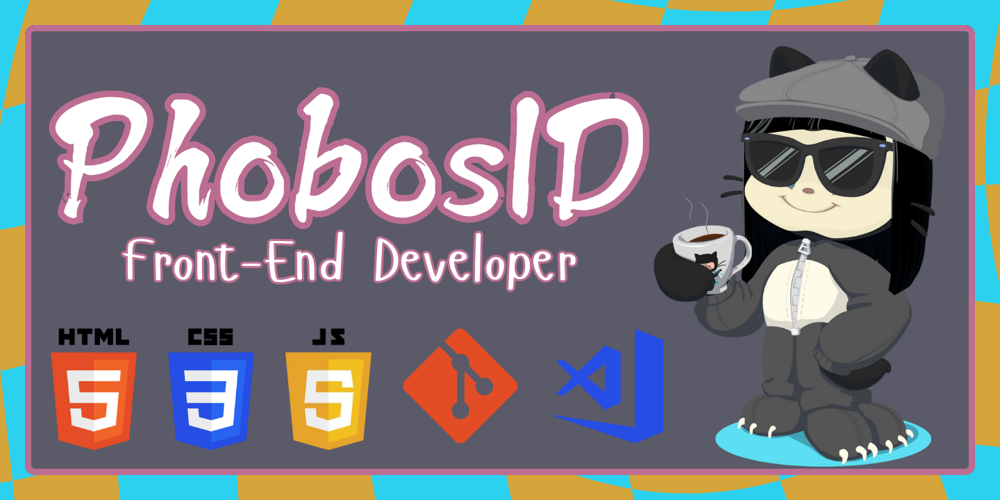

<h1 align="center">Hi 👋, I'm Kristoff Liao</h1>
<h3 align="center">Also known as my Online Name "PhobosID"</h3>

## Language and Tools

## Available At

## Operating System

## Computer Builds

## My GitHub Stats

